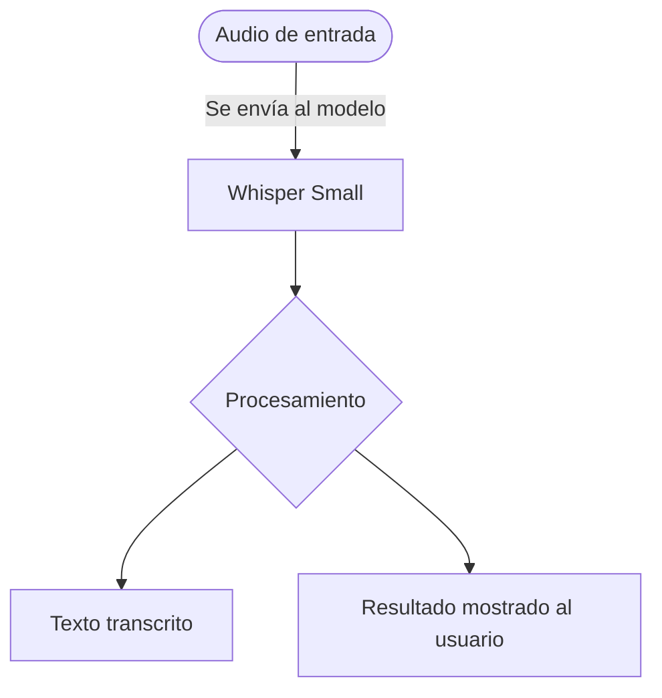
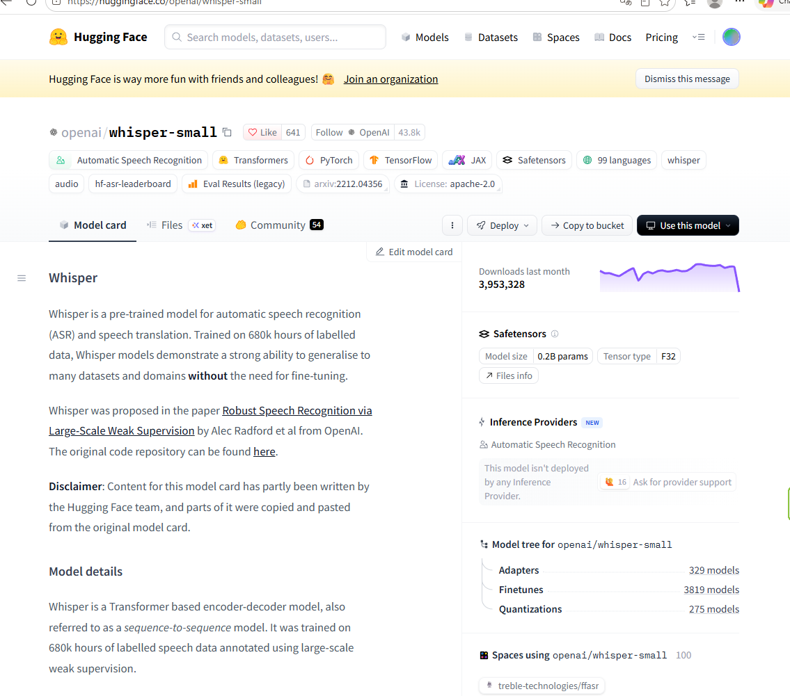

## Cómo funciona?

```mermaid
flowchart TD
    A([Audio de entrada]) -->|Se envía al modelo| B[Whisper Small]
    B --> C{Procesamiento}
    C --> D[Texto transcrito]
    C --> E[Resultado mostrado al usuario]
```

## 5. Evidencia

### Captura de la Model Card del modelo

\### Captura de la Model Card del modelo

\*\*Fuente:\*\* https://huggingface.co/openai/whisper-small

